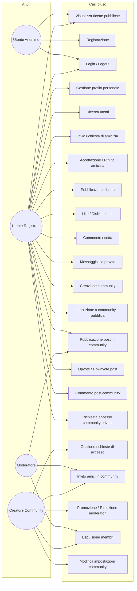

# Cinnamon

Il progetto consiste nella realizzazione di un social network chiamato Cinnamon, pensato per la condivisione di ricette culinarie tra utenti registrati.

Le funzionalità principali del sistema sono le seguenti:

## Registrazione e gestione del profilo personale

- Gli utenti possono iscriversi al sito e creare un profilo personale, comprensivo di foto, biografia e lista di interessi culinari o specialità gastronomiche.
- Al momento della registrazione, l'utente può scegliere se rendere il proprio profilo pubblico o privato.
- Nei profili privati, i dettagli sono visibili solo agli utenti con cui si è instaurato un contatto di amicizia.

## Relazioni tra utenti

- Gli utenti possono creare relazioni simmetriche di amicizia.
- Per diventare amici, un utente A deve inviare una richiesta ad un utente B, che deve accettarla affinché la relazione venga confermata.

## Ricerca utenti

- È possibile cercare altri utenti in base a caratteristiche quali: specialità preferita, livello di esperienza in cucina e interessi gastronomici.

## Gestione delle ricette

- Gli utenti registrati possono inserire e gestire le proprie ricette, indicando: ingredienti, procedimenti, tempo di preparazione, tempo di cottura, porzioni, difficoltà, tipo di cucina, foto, tag e note personali.
- Ogni ricetta può essere valutata tramite Like o Dislike e può ricevere commenti da altri utenti.
- I commenti supportano risposte annidate (thread), consentendo discussioni strutturate sotto ogni ricetta.
- Ogni ricetta ha tre livelli di visibilità: pubblica, solo amici o privata.

## Messaggistica privata

- Gli utenti connessi tra loro possono inviare e ricevere messaggi privati organizzati in conversazioni.
- Ogni conversazione raggruppa i messaggi tra i partecipanti, mantenendo uno storico ordinato.

## Sistema di notifiche

- Gli utenti ricevono notifiche in-app per eventi rilevanti, come inviti a community o richieste di accesso a community private.
- Le notifiche sono consultabili tramite un'apposita pagina e possono essere segnate come lette.

## Accesso anonimo

- Gli utenti non loggati possono visualizzare soltanto ricette presenti nei profili pubblici.
- Tutte le altre funzionalità richiedono l'autenticazione.

## Pagina pubblica e templating

- È possibile generare una pagina HTML pubblica a partire da template predefiniti, contenente il profilo e le ricette dell'utente, utilizzando il linguaggio di templating di Django.

## Home page personalizzata

- Per utenti loggati: la home mostra le ricette più votate tra gli amici dell'utente.
- Per utenti anonimi: la home mostra le ricette più votate tra i profili pubblici del sito.
- In entrambe le modalità, viene mostrata una classifica dei temi più utilizzati nelle ricette.

## Comunità tematiche

- Gli utenti possono creare comunità dedicate a specifiche tipologie di cucina o progetti culinari (es. "Dolci Vegani" o "Pane e Lievitati").
- Le comunità possono essere pubbliche o private (su invito).

All'interno delle comunità è possibile:

- Avviare discussioni tramite post iniziali.
- Commentare e votare i contenuti degli altri utenti, in stile Reddit (upvote/downvote con calcolo dello score).
- L'utente che crea la comunità ha diritti di moderazione sui contenuti, inclusa la possibilità di nominare altri moderatori.

Per le comunità private:

- I moderatori possono invitare amici tramite un sistema di inviti dedicato.
- Gli utenti esterni possono richiedere l'accesso; il creatore della comunità gestisce le richieste (accetta/rifiuta).
- L'accesso è consentito anche agli amici del creatore della comunità.

## UML dei Casi d'uso

## Diagramma delle classi

```mermaid
classDiagram
    class User {
        +String username
        +String email
        +String password
    }

    class UserProfile {
        +User user
        +String bio
        +ImageField profile_image
        +String experience_level
        +JSON cuisine_specialties
        +String culinary_interests
        +Boolean is_public
        +Boolean show_email
        +String location
        +Date birth_date
        +total_recipes()
        +friends_count()
        +total_likes_received()
        +get_specialties_display()
    }

    class FriendRequest {
        +User from_user
        +User to_user
        +String status
        +String message
        +DateTime created_at
        +accept()
        +reject()
    }

    class Friendship {
        +User user
        +User friend
        +DateTime created_at
        +are_friends()
        +get_friends()
    }

    class Notification {
        +User recipient
        +String message
        +String link
        +Boolean is_read
        +DateTime created_at
    }

    class Recipe {
        +String title
        +String description
        +ImageField image
        +String ingredients
        +String instructions
        +int prep_time
        +int cook_time
        +int servings
        +String difficulty
        +String cuisine_type
        +JSON tags
        +String personal_notes
        +String visibility
        +User author
        +total_likes()
        +total_dislikes()
        +rating_score()
    }

    class Like {
        +User user
        +Recipe recipe
        +DateTime created_at
    }

    class Dislike {
        +User user
        +Recipe recipe
        +DateTime created_at
    }

    class Comment {
        +Recipe recipe
        +User author
        +String content
        +Comment parent
        +Boolean is_approved
        +DateTime created_at
    }

    class Community {
        +String name
        +String description
        +ImageField image
        +User creator
        +String visibility
        +Boolean is_active
        +DateTime created_at
        +can_join()
        +is_member()
        +is_moderator()
    }

    class Community_members {
        +Community community
        +User user
        +DateTime joined_at
    }

    class Community_moderators {
        +Community community
        +User user
        +DateTime promoted_at
    }

    class CommunityPost {
        +Community community
        +User author
        +String title
        +String content
        +ImageField image
        +Boolean is_pinned
        +Boolean is_approved
        +Boolean is_locked
        +score()
        +total_votes()
    }

    class CommunityComment {
        +CommunityPost post
        +User author
        +String content
        +CommunityComment parent
        +Boolean is_approved
        +score()
    }

    class CommunityInvite {
        +Community community
        +User from_user
        +User to_user
        +String status
        +DateTime created_at
    }

    class CommunityJoinRequest {
        +Community community
        +User user
        +String status
        +String message
        +DateTime created_at
    }

    class Conversation {
        +ManyToMany participants
        +String title
        +DateTime created_at
        +get_latest_message()
    }

    class Message {
        +Conversation conversation
        +User sender
        +String content
        +Boolean is_read
        +DateTime created_at
    }

    User "1" -- "1" UserProfile
    User "1" -- "*" FriendRequest : invia
    User "1" -- "*" FriendRequest : riceve
    User "1" -- "*" Friendship
    User "1" -- "*" Notification
    User "1" -- "*" Recipe
    User "1" -- "*" Like
    User "1" -- "*" Dislike
    User "1" -- "*" Comment
    Recipe "1" -- "*" Like
    Recipe "1" -- "*" Dislike
    Recipe "1" -- "*" Comment
    Comment "1" -- "*" Comment : replies
    User "1" -- "*" Community : crea
    Community "1" -- "*" Community_members
    Community "1" -- "*" Community_moderators
    User "1" -- "*" Community_members
    User "1" -- "*" Community_moderators
    Community "1" -- "*" CommunityPost
    User "1" -- "*" CommunityPost
    CommunityPost "1" -- "*" CommunityComment
    CommunityComment "1" -- "*" CommunityComment : replies
    Community "1" -- "*" CommunityInvite
    Community "1" -- "*" CommunityJoinRequest
    User "1" -- "*" Conversation
    Conversation "1" -- "*" Message
    User "1" -- "*" Message : invia
```

---

## Organizzazione Logica dell'Applicazione

L'applicazione è strutturata secondo le best practice Django, suddivisa in più app dedicate a specifiche funzionalità:

### Struttura Principale

**config/**: Contiene la configurazione globale del progetto, tra cui settings, URL routing, wsgi/asgi e il file manage.py. Qui si definiscono le impostazioni generali, le app installate e la configurazione del database.

**users/**: Gestisce tutto ciò che riguarda gli utenti: registrazione, autenticazione, profili, amicizie e notifiche. Include modelli, form, viste, template e migrazioni specifiche per la logica utente.

**recipes/**: Si occupa della gestione delle ricette: creazione, modifica, cancellazione, visualizzazione, upload immagini, sistema di like/dislike e commenti. Contiene modelli, viste, template e migrazioni relative alle ricette.

**community/**: Gestisce le comunità tematiche: creazione, iscrizione, post con votazione stile Reddit, commenti, moderazione, inviti e richieste di accesso. Include modelli, viste, template e migrazioni specifiche per la logica delle comunità.

**user_messages/**: Si occupa della messaggistica privata tra utenti: gestione delle conversazioni e dei messaggi. Include modelli, viste, template e migrazioni dedicate.

**media/**: Directory per la gestione dei file statici e delle immagini caricate dagli utenti (foto profilo, immagini ricette, immagini community e post).

**templates/**: Raccolta dei template HTML suddivisi per app, per mantenere separazione tra logica e presentazione.

### Motivazione della Suddivisione

La suddivisione in app permette di mantenere il codice modulare, riutilizzabile e facilmente estendibile. Ogni app è responsabile di una specifica area funzionale, facilitando la manutenzione e lo sviluppo di nuove feature. Separare la logica utente, ricette, community e messaggistica consente di lavorare in team su parti diverse del progetto senza conflitti. La struttura segue le convenzioni Django, rendendo il progetto comprensibile a chiunque abbia esperienza con questo framework.

### Scelte Architetturali Particolari

- Uso di modelli relazionati (ForeignKey, ManyToMany) per gestire le relazioni tra utenti, ricette, community e richieste di amicizia.
- Utilizzo di modelli intermedi espliciti (through) per le relazioni ManyToMany nelle community (membri e moderatori), consentendo di memorizzare informazioni aggiuntive come la data di iscrizione o promozione.
- Utilizzo di migrazioni Django per la gestione evolutiva del database.
- Separazione netta tra logica di business (views, models) e presentazione (templates), per favorire la manutenibilità.
- Gestione delle immagini tramite la cartella media e la libreria Pillow, con validazione e ridimensionamento automatico lato backend.
- Organizzazione dei template in sottocartelle per app, per evitare sovrapposizioni e facilitare la personalizzazione dell'interfaccia.

---

## Tecnologie Utilizzate

### Backend

**Python 3.10**: Linguaggio di programmazione scelto per la sua sintassi chiara, ampia comunità e supporto a framework moderni. Versione 3.10 garantisce compatibilità con le librerie più recenti e prestazioni ottimizzate.

**Django 5.2.7**: Framework web robusto, sicuro e scalabile, ideale per la rapida prototipazione e la gestione di progetti complessi. Offre ORM integrato, sistema di autenticazione, gestione delle migrazioni e sicurezza avanzata.

### Frontend

**Bootstrap 5**: Framework CSS scelto per la sua flessibilità, responsività e ampia disponibilità di componenti UI. Permette di creare interfacce moderne e adattabili a tutti i dispositivi.

**HTML5 & CSS3**: Standard per la creazione di pagine web semantiche e stilisticamente avanzate.

### Database

**SQLite**: Database leggero, integrato di default con Django, ideale per progetti di piccola/media scala e sviluppo locale. Facilita la gestione senza necessità di server esterni.

### Gestione Form

**django-crispy-forms (v1.14.0)**: Libreria per la gestione avanzata dei form, scelta per la compatibilità con Bootstrap 4/5 e la semplicità di personalizzazione dei form.

### Gestione Immagini

**Pillow**: Libreria Python per la manipolazione di immagini, utilizzata per gestire upload e visualizzazione delle foto profilo e delle ricette.

### Gestione Dipendenze

**pipenv**: Strumento per la gestione degli ambienti virtuali e delle dipendenze Python, scelto per la sua integrazione con Pipfile e la semplicità di utilizzo.

### Motivazione delle Scelte

Tutte le tecnologie sono open source, ben documentate e supportate da una vasta comunità. Django consente di implementare rapidamente funzionalità complesse (autenticazione, relazioni tra modelli, gestione utenti) con sicurezza e scalabilità. Bootstrap garantisce un'interfaccia utente moderna e responsiva senza dover scrivere CSS da zero. SQLite è perfetto per lo sviluppo e test locale; per ambienti di produzione è possibile migrare facilmente a PostgreSQL o MySQL. L'uso di pipenv semplifica la gestione delle dipendenze e la riproducibilità degli ambienti. Le librerie scelte permettono di mantenere il progetto facilmente estendibile e manutenibile.

---

## Scelte Progettuali e Motivazione

Durante lo sviluppo di Cinnamon sono state prese alcune decisioni chiave per garantire funzionalità, usabilità e scalabilità:

### Gestione Amicizie e Liste di Attesa

**Richieste di amicizia**: Si è scelto di implementare un sistema di richieste pendenti, dove l'utente può inviare una richiesta e il destinatario può accettare o rifiutare. Questo approccio garantisce privacy e controllo sulle connessioni, evitando aggiunte automatiche.

**Gestione delle liste di attesa**: Per le community e le richieste di amicizia, si è preferito una gestione semplice tramite status (pending, accepted, declined) nei modelli, evitando code o strutture complesse che avrebbero aumentato la complessità senza reali benefici per il tipo di applicazione.

### Recommendation System

**Ricette e utenti suggeriti**: Non è stato implementato un recommendation system avanzato (es. collaborative filtering) per mantenere il progetto leggero e facilmente estendibile. Si è optato per semplici filtri basati su interessi, specialità e livello di esperienza, sfruttando le informazioni del profilo utente e delle ricette.

**Motivazione**: Un sistema di raccomandazione avanzato avrebbe richiesto una base dati più ampia e algoritmi complessi, non giustificati per la fase attuale del progetto. La scelta permette di aggiungere in futuro sistemi più sofisticati (es. machine learning) senza dover stravolgere la struttura.

### Gestione Immagini e Media

**Upload e validazione**: Si è scelto di gestire le immagini lato backend con Pillow, validando formato e dimensione per garantire sicurezza e performance. Le immagini vengono ridimensionate automaticamente al momento del salvataggio per ottimizzare lo spazio di archiviazione.

### Gestione Community

**Moderazione**: La gestione dei moderatori e dei membri è stata implementata tramite relazioni ManyToMany con modelli intermedi espliciti (through), permettendo flessibilità nella nomina e rimozione dei moderatori e tracciando informazioni temporali (data di iscrizione, data di promozione).

**Accesso alle community private**: Per le community private è stato implementato un duplice sistema: inviti diretti da parte dei moderatori e richieste di accesso da parte degli utenti esterni. Il creatore della community gestisce le richieste in entrata, potendo accettare o rifiutare ciascuna richiesta. Inoltre, gli amici del creatore hanno accesso automatico alla visualizzazione della community.

**Votazione stile Reddit**: I post e i commenti nelle community supportano un sistema di upvote/downvote con calcolo dinamico dello score, ispirato al modello di Reddit, per favorire la valorizzazione dei contenuti migliori.

### Gestione Messaggistica

**Messaggi privati**: La messaggistica tra utenti è stata implementata tramite un modello a conversazioni, dove ogni conversazione raggruppa i messaggi scambiati tra i partecipanti, mantenendo uno storico ordinato e supportando la lettura dei messaggi non letti.

### Motivazione Generale

Tutte le scelte sono state guidate dalla volontà di mantenere il progetto semplice, modulare e facilmente estendibile, senza introdurre complessità non necessarie nella fase iniziale. Le funzionalità implementate sono pensate per essere migliorate e ampliate in futuro, in base alle esigenze degli utenti e alla crescita della piattaforma.

---

## Test automatici

Nel progetto sono stati implementati test automatici suddivisi per app, per garantire la correttezza delle funzionalità principali.

### App users

I test unitari coprono i modelli FriendRequest, Friendship e UserProfile, verificando aspetti come la creazione e unicità delle richieste di amicizia, la gestione dell'accettazione e del rifiuto, la creazione delle relazioni di amicizia bidirezionali, la simmetria della relazione, la visualizzazione delle specialità utente e la coerenza dei dati anche in casi limite (ad esempio, impedire che un utente sia amico di se stesso o che esistano duplicati).

È stato inoltre sviluppato un test di integrazione sulla vista del profilo pubblico tramite il test client di Django. Questo test verifica la corretta risposta HTTP e il contenuto della pagina, controllando che:
- un profilo pubblico sia accessibile a tutti,
- un profilo privato sia visibile solo all'utente proprietario o agli amici,
- in caso di accesso non autorizzato a un profilo privato, l'utente venga reindirizzato e riceva un messaggio di avviso,
- il contesto della pagina contenga correttamente lo stato di amicizia tra gli utenti.

### App recipes

I test della vista RecipeListView (home page) verificano la logica di visibilità delle ricette:
- utenti anonimi vedono solo le ricette pubbliche,
- utenti autenticati vedono le ricette pubbliche e quelle degli amici, ma non quelle private di altri utenti,
- l'autore vede sempre le proprie ricette,
- il contesto contiene le statistiche utente (numero ricette, like ricevuti, amici).

Sono stati inoltre sviluppati test per l'endpoint toggle_like, verificando il corretto comportamento toggle (like/unlike), l'autenticazione richiesta, il rifiuto delle richieste GET e la risposta JSON con i campi attesi.

### App community

I test della vista CommunityDetailView verificano l'accesso a community pubbliche e private:
- le community pubbliche sono accessibili a utenti anonimi,
- le community private sono accessibili solo a membri, moderatori o amici del creatore,
- gli utenti non autorizzati vengono reindirizzati a una pagina di accesso negato,
- il contesto della pagina contiene correttamente lo stato di membro e moderatore.

I test di join/leave verificano la consistenza della membership:
- l'iscrizione aggiunge l'utente come membro,
- l'iscrizione richiede autenticazione,
- l'abbandono rimuove l'utente,
- l'iscrizione ripetuta non crea duplicati,
- il join diretto su community privata è bloccato con messaggio di errore.

Questi test assicurano che le regole di business e le restrizioni di privacy siano rispettate, coprendo sia input validi che situazioni di errore, e contribuiscono a mantenere affidabile l'applicazione nel tempo.
